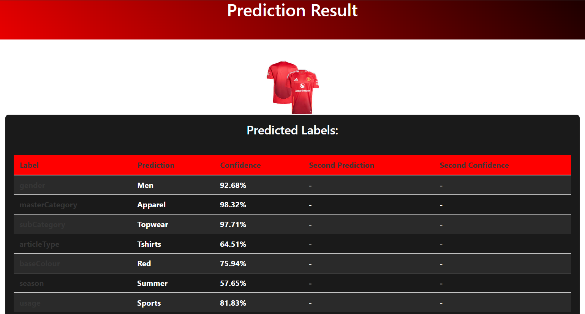
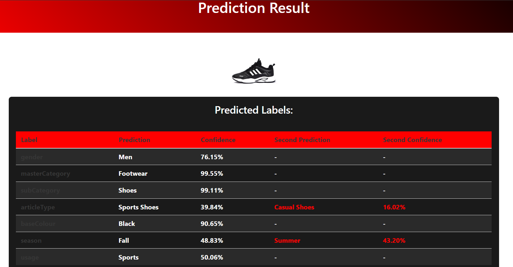

# **Fashion Tagger: AI-Powered Fashion Image Labeling**
[](https://colab.research.google.com/drive/1gDgDjP37RGlMNYUoeJy1zH31y5F4baZR?usp=sharing)


## Project Overview

<div style="display: flex; justify-content: space-between;">
  
  
</div>

Fashion Tagger is a web application that classifies fashion items using an AI model trained on the Kaggle dataset. The model, built using an ensemble of CNNs, predicts labels like category and color for each uploaded image. The application provides an intuitive interface for users to interact with the model, making AI-powered fashion labeling accessible and easy to use.

## Dataset Explanation

Fashion Tagger uses the **Fashion Product Images Dataset** from Kaggle, which contains over 44,000 fashion product images with detailed labels such as category, color, and season. This dataset is crucial for training our AI model to accurately predict fashion item attributes.

- **Dataset Source**: [Fashion Product Images Dataset on Kaggle](https://www.kaggle.com/datasets/paramaggarwal/fashion-product-images-dataset).


## **Quick Start Guide**

### **Environment Setup**
Ensure you have Python 3.8+ installed. Set up your environment and install dependencies using:
```bash
pip install flask torch torchvision timm joblib pytorch-lightning
```

### **Running the Application**
To run the Flask application locally:
```bash
python app.py
```

### **Accessing the Application**
Once the application is running, you can access it via your web browser at `http://localhost:5000`.

## **Project Architecture**

Fashion Tagger is a multi-layered project, consisting of data preprocessing and model training, followed by the development of a web application that serves as the interface for the AI model. Here's a brief overview of each layer:


### **1. Data Preprocessing and Model Training**
The first layer involves data preprocessing and training the AI model.
**✨ Interested in the magic behind the scenes?** Check out our detailed [Model Training and Preprocessing Documentation](preprocessing_and_training) to dive deep into how we prepared the data and trained our ensemble model, combining **EfficientNet-B3**, **ResNet50**, and **MobileNetV3** architectures for top-notch accuracy.


### **2. Application Structure**

#### **Backend**
The backend of the Fashion Tagger application is built using Flask, a lightweight web framework for Python. It handles the following key tasks:
- **Model Inference**: Once an image is uploaded, the backend preprocesses the image and uses the trained model to generate predictions.
- **Routing and API Management**: Flask manages the routes that connect the frontend to the backend, handling user requests and returning the predicted labels.
- **File Handling**: Uploaded images are temporarily stored, and their predictions are linked for easy access and display.

#### **Frontend**
The frontend is designed to provide a user-friendly interface for interacting with the model. It includes:
- **HTML/CSS/JavaScript**: The static pages are built using HTML for structure, CSS for styling, and JavaScript for dynamic elements.
- **Responsive Design**: The frontend uses the Bulma CSS framework to ensure that the application is responsive and accessible on different devices.
- **User Interaction**: The frontend allows users to easily upload images and view the predictions in a clear and visually appealing manner.


## Application Demonstration

<div style="display: flex; justify-content: space-between;">
  
  
</div>


## Future Work and Enhancements

1. **Foundation Models Integration:**
   Enhance accuracy by fine-tuning advanced pretrained models like **CLIP** (OpenAI), **ViT** (Google), and **DINO** (Meta) on our dataset for superior label prediction.

2. **Production Deployment:**
   - **Cloud Hosting**: Deploy on AWS, Google Cloud, or Azure for broader access.
   - **Dockerization**: Use Docker for consistent and scalable deployments.

3. **GANs for Image Generation and Suggestions:**
   - **Image Generation**: Implement GANs to create new fashion images based on desired attributes.
   - **Similar Image Suggestions**: Suggest visually similar products to enhance user experience.


## **License**

This project is licensed under the MIT License - see the [LICENSE](LICENSE) file for details.

## **Acknowledgments**

- **Dataset**: [Fashion Product Images Dataset](https://www.kaggle.com/datasets/paramaggarwal/fashion-product-images-dataset)
- **Frameworks**: Flask, PyTorch, PyTorch Lightning, Timm

## **Contact Information**

Created by Mahan Veisi - [LinkedIn](https://www.linkedin.com/in/mahan-veisi-427934226/) - [GitHub](https://github.com/MahanVeisi8)
