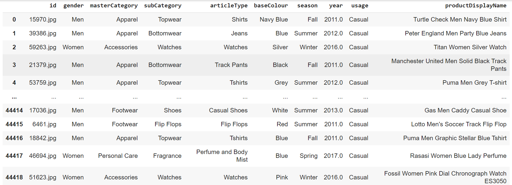
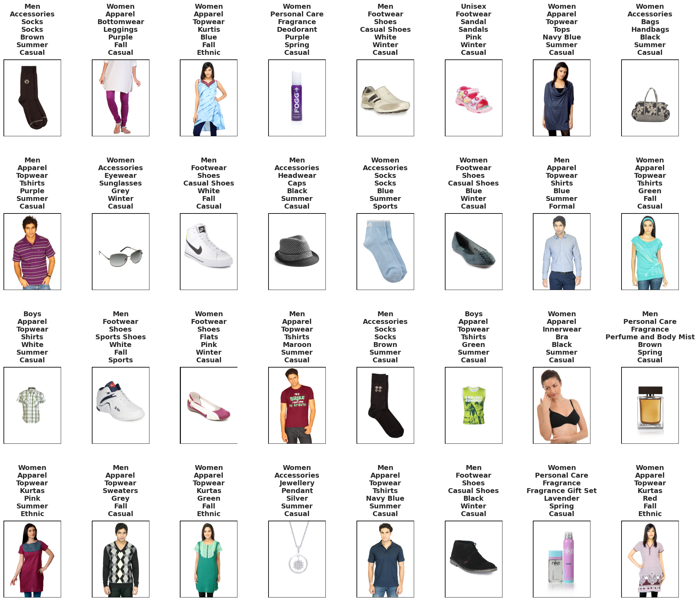

# **Fashion Tagger: ML Model for Multi-Label Fashion Classification**

[](https://colab.research.google.com/drive/1OcDUrJpxSpI-p2jbxc9P0KaU_3wgtvIK?usp=sharing)


## Setup

**Running the Notebook in Google Colab**
- The notebook is designed for easy execution in Google Colab, requiring no additional setup other than a Google account and internet access.😊

The code is designed to run in a Python environment with essential machine learning and simulation libraries. You can execute the notebook directly in Google Colab using the badge link provided, which includes a pre-configured environment with all necessary dependencies.

## **Data Preparation**

### **Data Collection**

To ensure the highest quality and accuracy in fashion image classification, we utilized the full **Fashion Product Images Dataset** from Kaggle, which includes over 44,000 images. Unlike the smaller, compressed version, this full dataset (25 GB) offers high-resolution images that are essential for accurately detecting attributes such as colors and fine details in fashion items.

Given the dataset's large size, processing was performed on Google Colab Pro with T4 GPU support, ensuring sufficient disk space and processing power for efficient handling and accelerated model training.


### **Dataset Overview and Initial Setup**

After obtaining the full Fashion Product Images Dataset, we loaded the dataset labels into a Pandas DataFrame, ensuring that all image paths and associated metadata were correctly mapped. Below is a preview of them:



### **Dataset Cleaning**

To ensure that our dataset was both complete and accurate, we implemented a cleaning process to remove any entries with missing images. This step was necessary to avoid potential issues during the training phase. After cleaning, the dataset shape was adjusted accordingly, ensuring only valid data was retained.

### **Dropping Irrelevant Columns**

During our analysis, we identified two columns—`year` and `productDisplayName`—that were not suitable for prediction:

- **Year**: The year column ranged between 2011 and 2017. Predicting the exact year a product was released based on its image is not logical, as many products look similar across different years.
- **Product Name**: The `productDisplayName` column contains verbose names that do not provide useful information for image-based classification. Moreover, these names are often inconsistent and redundant with other categorical labels.

Hence, these columns were dropped from further analysis to streamline the model's learning process.

### **Dataset Analysis**

We performed a thorough analysis of the dataset to understand its structure. This included checking for null values, counting unique values in each categorical column, and reviewing the overall distribution of labels.

### **Handling Imbalanced Data**

We found that the dataset had an imbalance in certain classes, with some categories having significantly fewer samples. This imbalance could potentially affect the model's performance. 

To address this, we decided to handle classes with fewer than 500 samples by relabeling them as 'None', effectively treating them as a generic "other" category. This approach allowed us to retain as much data as possible while avoiding the challenges of training on extremely small class sizes. This process reduced the risk of overfitting to rare classes and ensured a more robust model.

Below is an example of the dataset after processing and label adjustments:




## **Model Training**

### **Model Architecture**
The model is based on an EfficientNet-B3 backbone, fine-tuned for our multi-label classification task. The architecture includes custom classifier layers designed to output predictions across multiple labels.

### **Training Process**
The training process is managed with PyTorch Lightning, incorporating:
- **Early Stopping**: To avoid overfitting.
- **Learning Rate Scheduling**: For optimal convergence.
- **Checkpointing**: To save the best model based on validation performance.

```python
trainer = pl.Trainer(max_epochs=80, accelerator='gpu', devices=1)
trainer.fit(model, train_loader, val_loader)
```

### **Monitoring and Logging**
Training progress is logged with TensorBoard, allowing for real-time monitoring of metrics such as loss and accuracy.

## **Evaluation**

### **Performance Metrics**
The model's performance is evaluated using class-wise precision, recall, and F1-score. The results are visualized to provide insights into the model's strengths and areas for improvement.

### **External Data Testing**
The model is tested on external images to validate its performance in real-world scenarios, with predictions being displayed alongside the images.

## **Results**

The final model achieves strong accuracy across all label categories, with F1-scores consistently high for primary attributes like gender, category, and color.

**Sample Predictions:**


## **Future Work and Enhancements**

1. **Advanced Pretrained Models**: Plan to integrate foundation models like CLIP, Vision Transformer (ViT), and DINO for even higher accuracy.
2. **Production Deployment**: Deploy the model via Docker and cloud platforms for broader accessibility.
3. **Image Generation with GANs**: Introduce a GAN-based feature to generate and suggest fashion images based on user input.

## **Contributing**

Contributions are welcome! Please submit pull requests for any improvements or bug fixes.

