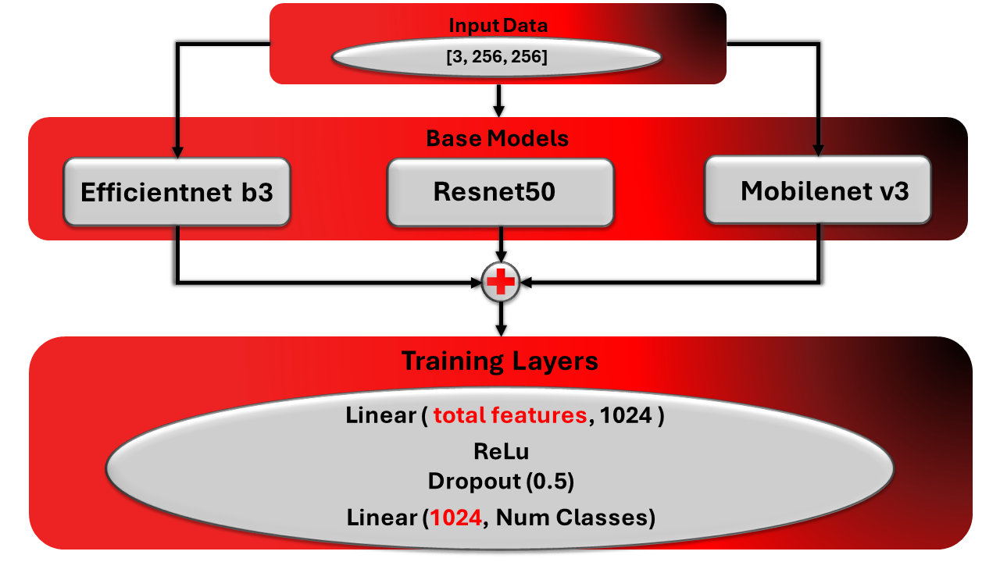
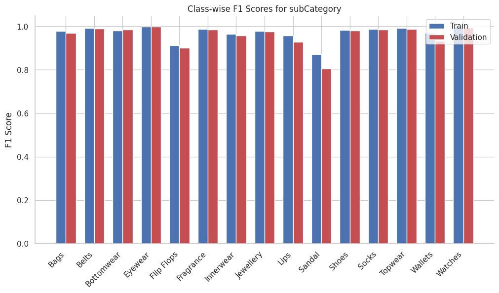

# **Fashion Tagger: ML Model for Multi-Label Fashion Classification**

## **Introduction**

The Fashion Tagger is a machine learning model developed for multi-label fashion classification, capable of accurately tagging various attributes of fashion items such as gender, master category, subcategory, article type, base color, season, and usage. Leveraging an ensemble of state-of-the-art deep learning architectures—**EfficientNet-B3**, **ResNet50**, and **MobileNetV3**—this model combines the strengths of each to enhance feature extraction and classification performance.

With the increasing demand for automated fashion item tagging in e-commerce and retail, this model aims to provide a scalable and accurate solution. By using the comprehensive **Fashion Product Images Dataset** from Kaggle, which includes over 44,000 high-resolution images, the model has been trained to recognize fine-grained details, making it a powerful tool for real-world applications.

This README outlines the process from data preparation and model training to evaluation, demonstrating how the model achieves high accuracy across multiple labels and generalizes well to unseen data.

## Setup

**Running the Notebook in Google Colab**
- The notebook is designed for easy execution in Google Colab, requiring no additional setup other than a Google account and internet access.😊

The code is designed to run in a Python environment with essential machine learning and simulation libraries. You can execute the notebook directly in Google Colab using the badge link provided, which includes a pre-configured environment with all necessary dependencies.

## **Data Preparation**

### **Data Collection**

To ensure the highest quality and accuracy in fashion image classification, we utilized the full **Fashion Product Images Dataset** from Kaggle, which includes over 44,000 images. Unlike the smaller, compressed version, this full dataset (25 GB) offers high-resolution images that are essential for accurately detecting attributes such as colors and fine details in fashion items.

Given the dataset's large size, processing was performed on Google Colab Pro with T4 GPU support, ensuring sufficient disk space and processing power for efficient handling and accelerated model training.

### **Dataset Overview and Initial Setup**

After obtaining the full Fashion Product Images Dataset, we loaded the dataset labels into a Pandas DataFrame, ensuring that all image paths and associated metadata were correctly mapped. Below is a preview of them:

### **Dataset Cleaning**

To ensure that our dataset was both complete and accurate, we implemented a cleaning process to remove any entries with missing images. This step was necessary to avoid potential issues during the training phase. After cleaning, the dataset shape was adjusted accordingly, ensuring only valid data was retained.

### **Dropping Irrelevant Columns**

During our analysis, we identified two columns—`year` and `productDisplayName`—that were not suitable for prediction:

- **Year**: The year column ranged between 2011 and 2017. Predicting the exact year a product was released based on its image is not logical, as many products look similar across different years.
- **Product Name**: The `productDisplayName` column contains verbose names that do not provide useful information for image-based classification. Moreover, these names are often inconsistent and redundant with other categorical labels.

Hence, these columns were dropped from further analysis to streamline the model's learning process.

### **Dataset Analysis**

We performed a thorough analysis of the dataset to understand its structure. This included checking for null values, counting unique values in each categorical column, and reviewing the overall distribution of labels.

### **Handling Imbalanced Data**

We found that the dataset had an imbalance in certain classes, with some categories having significantly fewer samples. This imbalance could potentially affect the model's performance. 

To address this, we decided to handle classes with fewer than 500 samples by relabeling them as 'None', effectively treating them as a generic "other" category. This approach allowed us to retain as much data as possible while avoiding the challenges of training on extremely small class sizes. This process reduced the risk of overfitting to rare classes and ensured a more robust model.

Below is an example of the dataset after processing and label adjustments:

### **Data Transformation and Encoding**

After ensuring that our dataset was cleaned and balanced, we proceeded with the transformation and encoding of categorical labels. Each label was one-hot encoded across seven categories: `gender`, `masterCategory`, `subCategory`, `articleType`, `baseColour`, `season`, and `usage`. This process converted categorical labels into binary vectors, which the model could process more efficiently.

To ensure fair representation of all classes during training, we implemented stratification. This technique maintained the distribution of categories across both the training and validation sets, ensuring that each class was well-represented. 

Our dataset was split into training and validation sets with an 80/20 ratio, resulting in:

- **Training set:** 35,749 samples
- **Validation set:** 8,670 samples

We verified the distribution of labels by plotting the distribution for both the training and validation sets. As expected, the validation set distributions closely mirrored those of the training set, demonstrating that our stratification was successful.

### **Image Transformations and DataLoader**

Given the large size of our dataset, it was crucial to implement efficient data loading. We applied image transformations including resizing, normalization, and augmentation to standardize the input images and improve model generalization. 

To handle the large dataset effectively, we utilized DataLoaders, which allowed us to process data in batches rather than loading the entire dataset into memory at once. This approach was crucial for managing memory usage and speeding up training times. By leveraging all available CPU cores, we optimized data loading, reducing the time required to process each epoch.

A key aspect of this setup was ensuring that the DataLoader efficiently handled batches, utilizing all available CPU cores to load data while the GPU processed the current batch. This ensured that the GPU was utilized to its fullest, minimizing idle time and maximizing training efficiency.

Below is a visual representation of a batch of images after transformation:

### **Label Mapping and Handling 'None' Classes**

We created a dictionary of label mappings to assign each category a specific position in the one-hot encoded vectors, which was crucial for decoding predictions and interpreting model outputs.

To manage imbalanced classes, we created a mask for the 'None' labels, ensuring they were excluded from the loss calculation. This allowed the model to focus on learning more critical labels, improving its overall performance.

Below is an example of a label vector for a single image and its corresponding mask:

| **Label Vector**                                                                                     | **None Label Mask**                                                                                 |
|-------------------------------------------------------------------------------------------------------|------------------------------------------------------------------------------------------------------|
| `tensor([0., 0., 1., 0., 0., 0., 1., 0., 0., 0., 0., 0., 0., 0., 0., 0., 0., 0., 0., 0., 0., 0., 1., 0., 0., 0., 0., 0., 0., 0., 0., 0., 0., 0., 0., 0., 0., 0., 0., 1., 0., 0., 0., 0., 0., 0., 0., 0., 0., 0., 0., 0., 1., 0., 0., 0., 0., 0., 0., 0., 0., 0., 0., 0., 0., 0., 0., 1., 0., 0., 0., 0., 1., 0., 0., 0., 0.], dtype=torch.float64)` | `tensor([1., 1., 1., 1., 1., 1., 1., 1., 1., 0., 1., 1., 1., 1., 1., 1., 1., 1., 1., 1., 1., 1., 1., 1., 1., 0., 1., 1., 1., 1., 1., 1., 1., 1., 1., 1., 1., 1., 1., 1., 1., 1., 1., 1., 1., 1., 1., 1., 1., 0., 1., 1., 1., 1., 1., 1., 1., 1., 1., 1., 1., 1., 1., 1., 0., 1., 1., 1., 1., 0., 1., 1., 1., 1., 0.])` |

## **Model Definition and Training**

We developed an ensemble model combining **EfficientNet-B3**, **ResNet50**, and **MobileNetV3** to leverage the strengths of each architecture in feature extraction.

**Key Features:**
- **Ensemble Architecture**: Features from the three base models are concatenated and passed through a custom fully connected layer to produce final predictions.
- **Loss Calculation**: Binary Cross-Entropy with Logits Loss was used, excluding 'None' labels to focus on significant categories.
- **Regularization**: Employed **Dropout** and **ReLU** activation in the final layers to prevent overfitting.

**Training Configurations:**
- **Early Stopping**: Training halts after 20 epochs of no improvement in validation loss.
- **Gradient Clipping**: Applied with a value of 0.5 to maintain stable training.

This setup allows the model to generalize well while efficiently handling the complexity of multi-label classification.
 is logged with TensorBoard, allowing for real-time monitoring of metrics such as loss and accuracy.

## **Evaluation**

### **Training and Validation Performance**

We evaluated the model using the training and validation datasets to ensure robust performance. The training and validation accuracy reached approximately **95%**, demonstrating no signs of overfitting. This high accuracy indicates the model's ability to generalize well across unseen data.

### **Class-wise Performance Analysis**

To gain deeper insights into the model's performance, we examined the class-wise accuracy for key categories such as gender, master category, subcategory, article type, base color, season, and usage.

- **Gender, MasterCategory, SubCategory, and ArticleType**: These classes achieved high accuracy, indicating that the model effectively identifies these attributes in fashion items.
- **Season and Usage**: These classes showed slightly lower accuracy, reflecting the inherent challenges in predicting these attributes.

### **F1 Score Analysis**

The F1 score, which combines precision and recall, was calculated for each label within the classes. The formula used for F1 score is:

\[
\text{F1 Score} = 2 \times \frac{\text{Precision} \times \text{Recall}}{\text{Precision} + \text{Recall}}
\]

#### **Class-wise F1 Score Breakdown**

Below is the class-wise F1 score breakdown for both training and validation sets, illustrating the model's precision and recall performance across different labels.

<table>
  <tr>
    <td></td>
    <td></td>
    <td></td>
  </tr>
  <tr>
    <td></td>
    <td></td>
    <td></td>
  </tr>
  <tr>
    <td></td>
    <td></td> <!-- Empty cell -->
    <td></td> <!-- Empty cell -->
  </tr>
</table>

**Brief Analysis**:
- **Gender**: The model performs consistently well across all gender labels.
- **MasterCategory**: High F1 scores indicate strong performance, particularly for common categories like Apparel and Accessories.
- **SubCategory**: Most subcategories show strong F1 scores, with a few like 'Flip Flops' being slightly lower.
- **ArticleType**: High F1 scores across various article types, except for a few outliers like 'Perfume and Body Mist.'
- **BaseColour**: The model struggles slightly with predicting colors like 'Beige' and 'Maroon.'
- **Season**: Prediction for 'Fall' and 'Spring' seasons is less accurate compared to 'Winter' and 'Summer.'
- **Usage**: Consistent performance with slight challenges in predicting 'Sports' usage.

### **Visual Evaluation**

We compared the model's predictions with actual labels for several images from the validation set. The model's predictions aligned well with the actual labels, confirming its effectiveness.

### **Testing on External Data**

To further assess the model's robustness, we tested it on external data outside the Kaggle dataset. The model demonstrated good predictive capability on new, unseen images, confirming its generalization ability.

